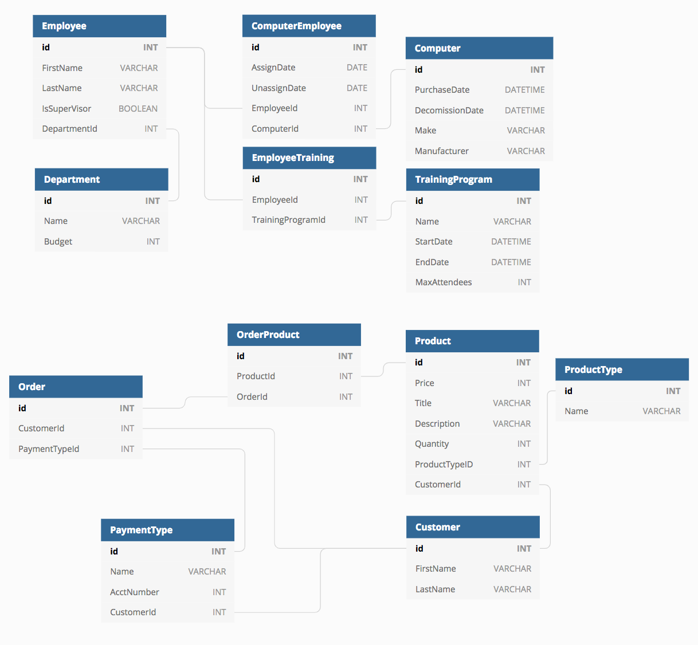

# BangazonAPI
---
Welcome to Bangazon! The new virtual marketplace. This marketplace allows customers to buy and sell products through a single page application web page built in React. The application's data is tracked through a powerful, hand-crafted API built in C#/ADO.Net

## Software Requirements
---
Sql Server Manangment Studio 
Visual Studio Community 2017 
Google Chrome

## Entity Relationship Diagram
---



## Http Request Methods
## 1. Customer
Start the program by cd'ing into the BangazonAPI and using the command dotnet run. Once the program is running, open up the Postman desktop app and run the following commands:
### GET
- select GET then paste localhost:5000/customer into the field and click send. The result should be an array of all the customers in the database.

- select GET then paste http://localhost:5000/customer?_include=payments into the field and click send. The result should be an array of all the customers in the database with all of the payment types included in that customers as well.

- select GET then paste http://localhost:5000/customer?_include=products into the field and click send. The result should be an array of all the customers in the database with all of the products types included in that customers as well.

- select GET then paste http://localhost:5000/customer?q=sat into the field and click send. The result should be an array of all the customers in the database with first or last names that contains sat.

- select GET then paste localhost:5000/customer/1 or any other number that showed up in the previous query as CustomerId and click send. The result should be only that object of the specified Customer

### POST
select POST, then paste localhost:5000/customer into the field, then click Body underneath the field, then select raw, and then paste this snippet or make one similar
``` 
	{
        "FirstName": "Test",
        "LastName": "Customer"
    } 
```
then click send. The result should be the new customer you made.

### PUT
select PUT then paste localhost:5000/customer/1 or any other Customer Id , then click Body underneath the field, then select raw, and then paste this snippet or make one similar
``` {
        "FirstName": "Test",
        "LastName": "Instructions"
    } 
```
You should get nothing back from this. When you run the GET query the Customer you specified in your PUT query should show the updated, edited information you gave it.

## 2. Department
Use the command dotnet run to start the program, BangazonAPI. Once the program is running, open up the Postman desktop app and run the following commands for each request method:

### GET
To GET all Departments, select GET in Postman then paste localhost:5000/department into the field and click send. The result should be an array of all the Departments in the database.

- select GET then paste http://localhost:5000/department?_include=employee into the field and click send. The result should be an array of all the department in the database with all of the products included in that department as well.

- To GET a specific, single Department, add an /{id} to the end of the localhost:5000/department URL. The result should only include the single department with the Id you added.

### POST
To POST a new object to your existing array for Department, select POST, then paste localhost:5000/department into the field. Then click Body underneath the field, select raw, and then paste this below snippet or make one similar then click send. The result should be the new Department you made:
```
  {
        "DepartmentName": "Test",
        "ExpenseBudget": "300000"
    }
```

### PUT
To update an existing Department, select PUT then paste localhost:5000/Department/2 or any other existing department. Then follow the same directions as the POST example, and change the values then click send:
```
{
"DepartmentName":"NewDepartmentName",
"ExpenseBudget":"234234"
}
```
## 3. Employee
Use the command dotnet run to start the program, BangazonAPI. Once the program is running, open up the Postman desktop app and run the following commands for each request method:

### GET
To GET all employees, select GET in Postman then paste localhost:5000/employee into the field and click send. The result should be an array of all the Employees in the database.

- To GET a specific, single order, add an /{id} to the end of the localhost:5000/employee URL. The result should only include the single employee with the Id you added.

### POST
To POST a new object to your existing array for Employee, select POST, then paste localhost:5000/employee into the field. Then click Body underneath the field, select raw, and then paste this below snippet or make one similar then click send. The result should be the new Employee you made.

### PUT
To update an existing employee, select PUT then paste localhost:5000/employee/2 or any other existing employee. Then follow the same directions as the POST example, and change the values then click send:
```
{
"employeeId": 2,
    "FirstName": "Jack",
    "LastName": "Bob",
    "IsSupervisor": false,
    "DepartmentId": 2,
}
```
You should get nothing back from this besides an OK status. When you run the GET query the employee you specified in your PUT query should show the updated, edited information you gave it.
